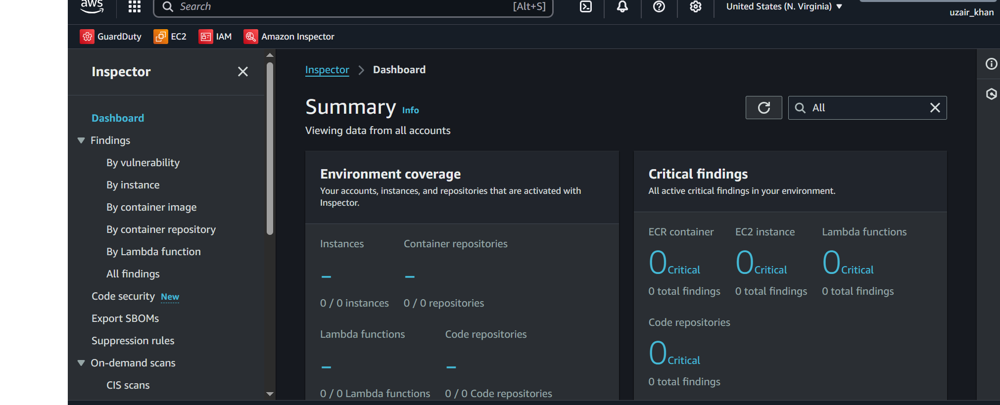

# Securing-the-Development-Pipeline-Using-Amazon-Inspector
Developed a secure development pipeline by integrating a application with Amazon Inspector, injecting vulnerabilities such as SQL injection during development commits, and reviewing Inspector alerts to strengthen application security.

  

## Overview
The secure development pipeline is a process that helps developers build secure applications from the start. It works by finding and fixing security issues early in the development process, rather than waiting until after the app is deployed.

## Tools and Services Used

**Amazon Inspector** (Security assessment service)  
**Github** (Source Code Repository)  
**Secure Code Review**  
**Vulnerable Application** (Purposely designed application that contains known vulnerabilities)

## Workflow

1- Start by creating a simple Python application that includes secure login functionality. This serves as the base application that will be connected to AWS Inspector for security scanning. (Vuln App can be found on the repo named as **Vulnerable_code.py**)

2- Log in to the AWS console and search for Amazon Inspector. Enable the service, which brings you to the Inspector dashboard where code scanning and vulnerability analysis can be configured.
***

  

***

