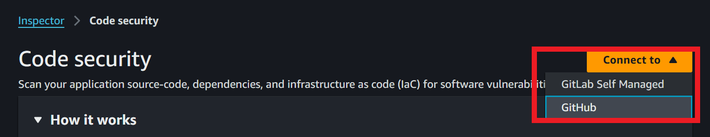
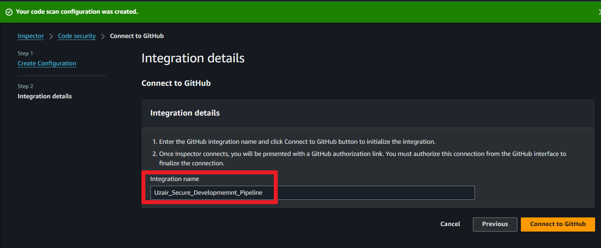
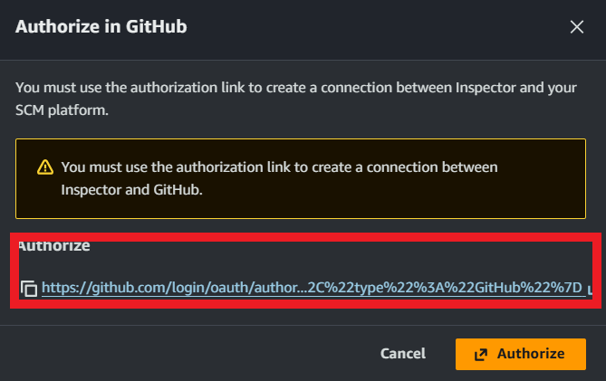
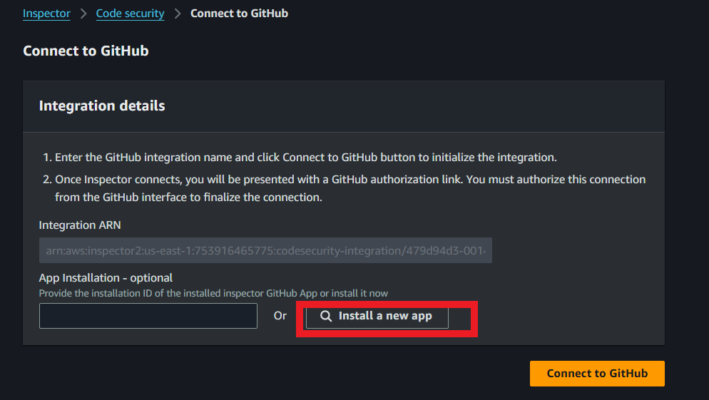
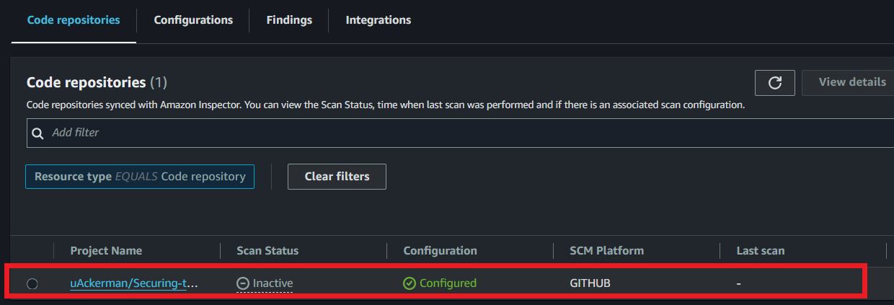
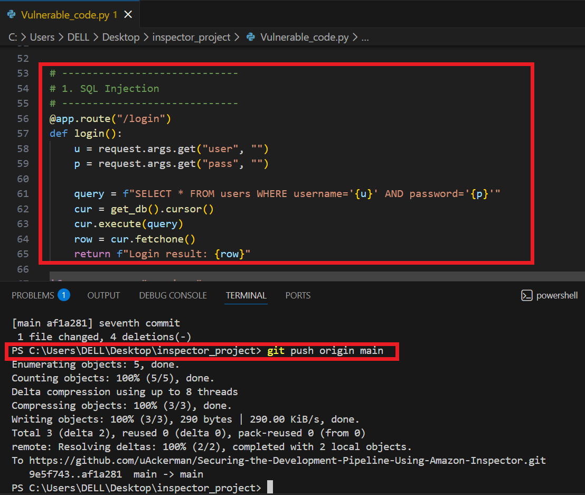
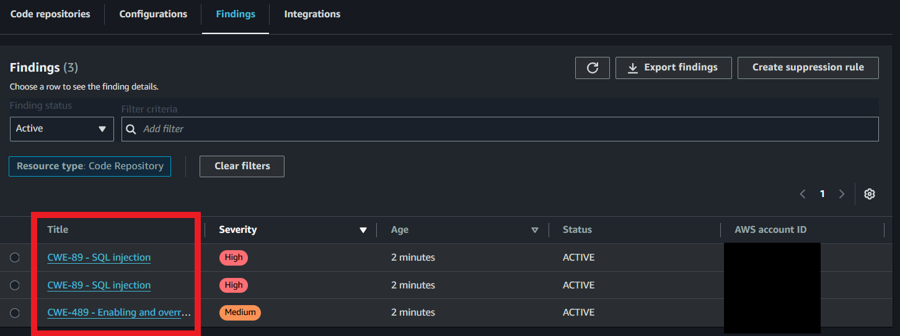
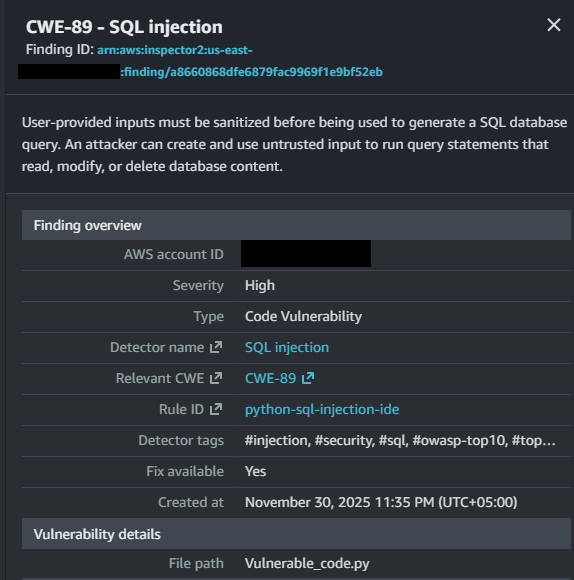
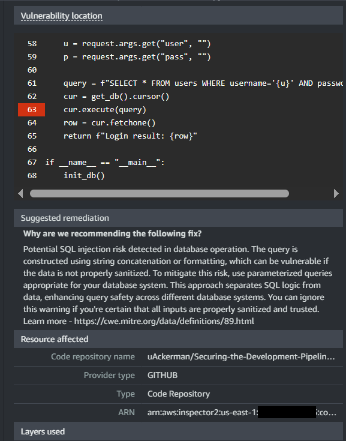
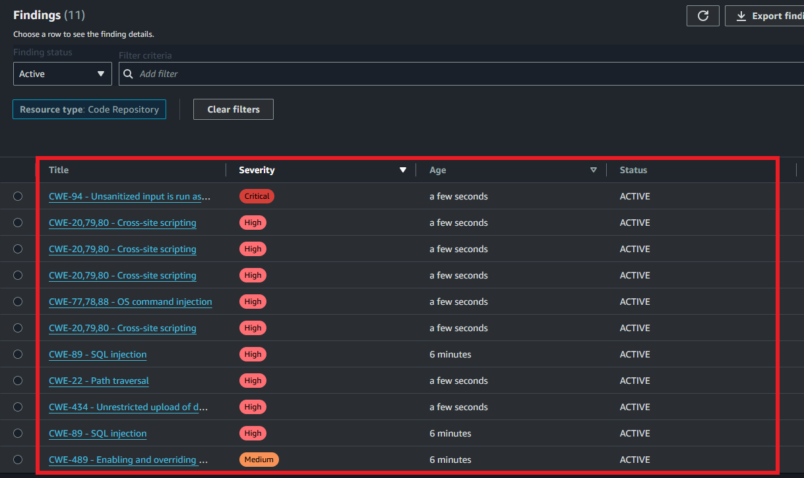

# Securing-the-Development-Pipeline-Using-Amazon-Inspector
Developed a secure development pipeline by integrating a application with Amazon Inspector, injecting vulnerabilities such as SQL injection during development commits, and reviewing Inspector alerts to strengthen application security.

**Author:** Uzair Khan

## Overview
The secure development pipeline is a process that helps developers build secure applications from the start. It works by finding and fixing security issues early in the development process, rather than waiting until after the app is deployed.

  

## Tools and Services Used

**Amazon Inspector** (Security assessment service)  
**Github** (Source Code Repository)  
**Secure Code Review**  
**Vulnerable Application** (Purposely designed application that contains known vulnerabilities)

## Workflow

1- Start by creating a simple Python application that includes secure login functionality. This serves as the base application that will be connected to AWS Inspector for security scanning. (Vuln App can be found on the repo named as **Vulnerable_code.py**)

2- Log in to the AWS console and search for Amazon Inspector. Enable the service, which brings you to the Inspector dashboard where code scanning and vulnerability analysis can be configured.
***

  

***

3- From the left-side menu, select Code Security. Here, initiate the connection to your GitHub account.
Fill in the required configuration details based on your environment settings.
***

  

***

  

***

4- When prompted, approve the GitHub authorization request so Inspector can access your repositories.
Afterward, install the Amazon Inspector GitHub App and select the specific repository you want it to monitor.
***

  

***

  

***

**Within a few minutes, Inspector will complete synchronization with your repository.**
***

  

***

5- Commit and push intentionally vulnerable code to the repository for example, adding an SQL injection flaw in the Python application.
As soon as the commit is pushed, Amazon Inspector automatically analyzes the updated code and identifies security issues.
***

  

***

6- When Inspector detects vulnerabilities, it generates clear findings in the dashboard.
***

  

***

**One key advantage of Inspector is that each finding includes recommended remediation steps, along with the exact location of the vulnerable code.**
***

  

***

  

***

7- To further evaluate the pipeline, additional insecure code was committed, including:

**Cross-Site Scripting (XSS)**    
**Path Traversal**   
**Command Injection**  
***

  

***

Inspector successfully detected these vulnerabilities as well, confirming that the secure development pipeline functions as intended.

## Conclusion
This project demonstrates a secure development pipeline using Amazon Inspector. By injecting vulnerabilities like SQL injection and XSS, the pipeline detects and reports security issues early, helping developers fix them before deployment. It ensures the application is more secure and resilient to common attacks.

