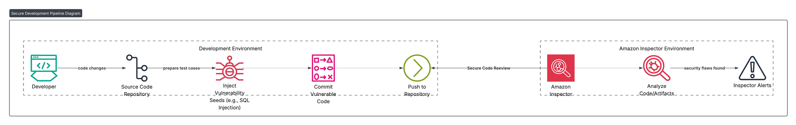

# Securing-the-Development-Pipeline-Using-Amazon-Inspector
Developed a secure development pipeline by integrating a application with Amazon Inspector, injecting vulnerabilities such as SQL injection during development commits, and reviewing Inspector alerts to strengthen application security.

